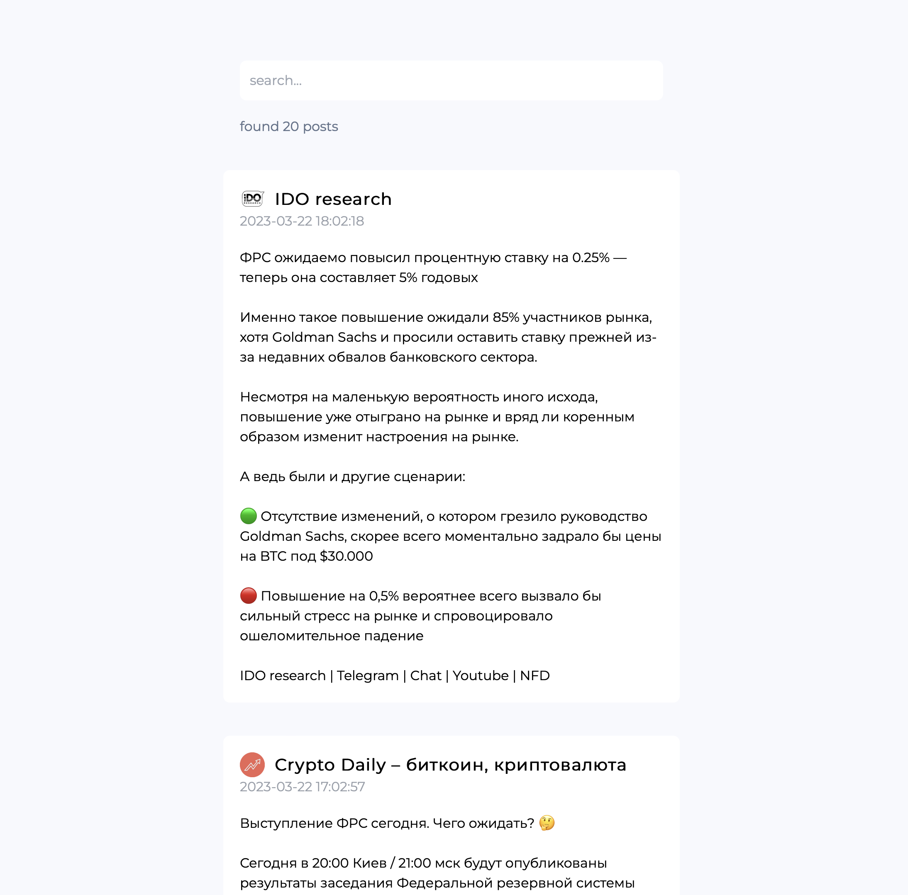
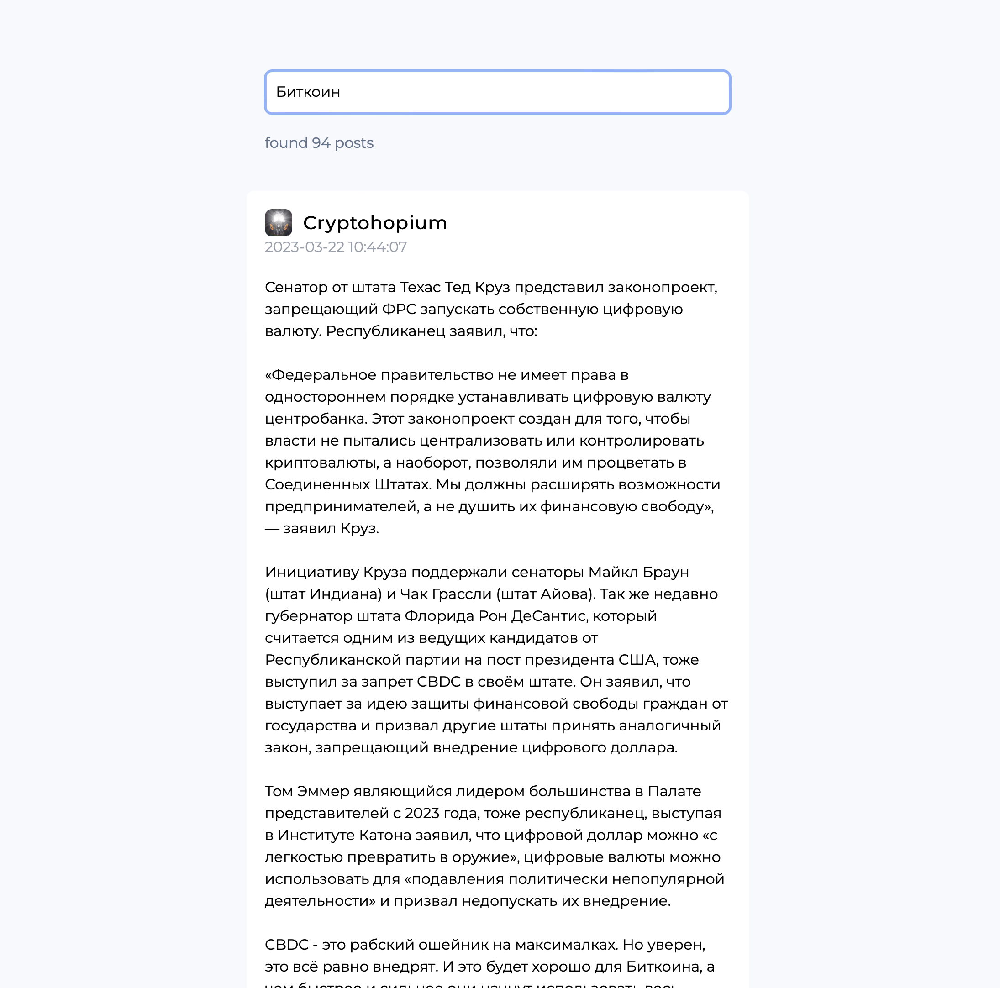

# mirror
aggregator of news and posts from multiple platforms, currently only support telegram

## Features
* [x] Listen to new posts from telegram and save them
* [x] Web interface
* [x] Search by keywords 
* [ ] ...


## Screenshots




## Installation
1. clone the repository
```
git clone https://github.com/fidesy/mirror.git
```

2. Create .env file with all variables from .env.example. Find api_id and api_hash from your telegram account [(guide)](https://core.telegram.org/api/obtaining_api_id)

3. activate python environment and install dependencies
```
python3 -m venv venv
source venv/bin/activate
pip install -r requirements.txt
cp requirements.txt mirror
```

4. Run the app to init telegram client and copy it to the mirror directory. This is needed to create session file for transfer to the docker container.
```
python mirror/init_client.py
cp *.session mirror
```

5. set env variable for the correct installation, build and run docker app containers
```
export DOCKER_DEFAULT_PLATFORM=linux/amd64
docker compose up -d
```

now website is available at localhost:3000

## Usage

You can manage your appication using the API.

Add channel and parse the latest 50 posts.
```
curl -H "X-TOKEN: YOUR_CUSTOM_ENV_TOKEN" -X POST http://localhost:8000/api/channel?username=CHANNEL_USERNAME
```

Delete the channel and all its posts.
```
curl -H "X-TOKEN: YOUR_CUSTOM_ENV_TOKEN" -X DELETE http://localhost:8000/api/channel?username=CHANNEL_USERNAME
```